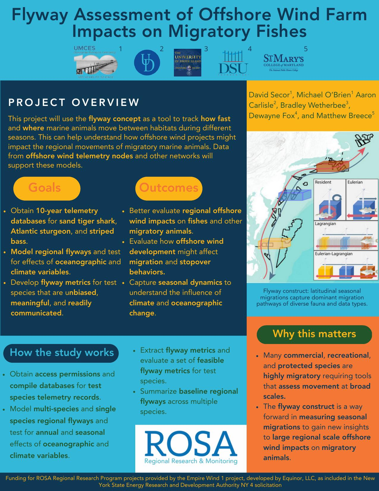

Welcome to the Git book for _Flyway Assessment of Offshore Wind Farm Impacts on Migratory Fishes_, a project funded by the [Responsible Offshore Science Alliance](https://www.rosascience.org). Scroll down to skim the fact sheet for the project or watch a presentation from analyst Mike O'Brien.

::: {.callout-warning}
This book is undergoing rapid development and is not peer reviewed. Everything you read should be considered preliminary and subject to substantial change.
:::

# Fact Sheet

# Presentation
