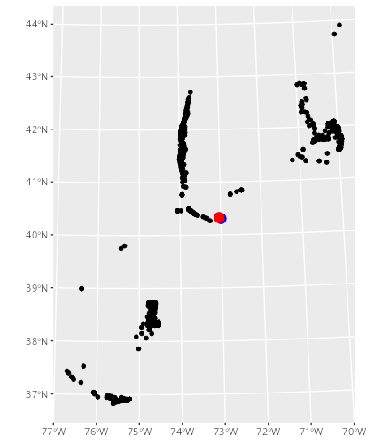
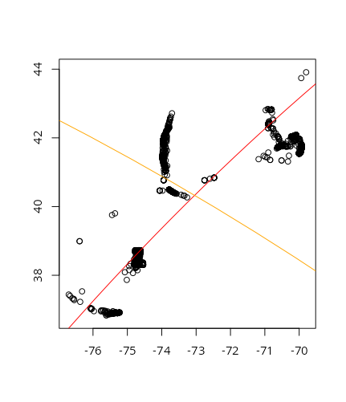
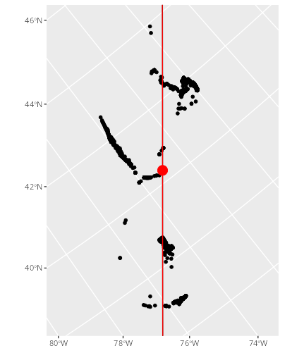

The first step of the flyway model is to rotate animal tracking data into a "migration north" frame of reference [@secor2025]; we are actively researching different manners of identifying this dominant vector of migration. This report summarizes our initial investigation into the premise of modeling migration north using a tangent principal components analysis (tangent PCA). At a high level, this requires the following steps:

1.  Calculate an optimal point of tangency to the Earth's surface.
2.  Project geodetic animal coordinates (lat/lon) into a Cartesian plane (X/Y) defined by a plane tangent to the Earth at the optimal point of tangency.
3.  Find the synthetic axis of greatest variation, "Migration North" [@secor2025], via PCA.
4.  Rotate the data such that they are in reference to migration north using the eigenvectors of the PCA.

## Step 1: Calculate an optimal point of tangency

Like all geometric manifolds, the Earth, being 3-dimensional and ellipsoid in shape, approximates 2-dimensional Euclidean space on small scales. This simplification can fall apart on the continental-to-hemispheric scale of migration, leading to a choice: treat location data as on an ellipsoidal manifold or project into lower-dimensional Euclidean space. As the math needed to calculate positions, directions, and areas on a manifold are far more complicated than that in Euclidean space, humans have historically chose the latter. Indeed, there are a multitude of map projections, the development of which has been an area of active research for millennia [@snyder1993].

Map projections can generally only maintain one of the following: distance, direction, or area. Some projections can maintain two, but only in reference to a single point. As such, this center of projection is critical -- we use it to define the point at which we create our tangent plane.

Usually, we could just find the point that minimizes the distance to all other points, perhaps as a mean or median. However the shortest path between two points on a manifold is not a straight line: a straight line will usually place the point within the manifold. The shortest path between two points on the Earth, the "great circle distance", is a path along the surface: a geodesic.

The geodesic mean or median takes into account the curvature of the Earth, and ensures that the location that minimizes the distance to other points is on the surface of the Earth. Even here, we treat the Earth as a sphere, which is untrue but closer to reality than a flat plane, and convert latitude and longitude (the angle between 0$^\circ$ and the location at the center of the Earth) to XYZ coordinates on a unit sphere.

### Formulae

-   Covert latitude and longitude (in radians) to spherical coordinates:

\begin{align}
x &= cos(lat) * cos(lon) \\
y &= cos(lat) * sin(lon) \\
z &= sin(lat)
\end{align}

-   Calculate geodesic distance between the center of projection $(X_0, Y_0, Z_0)$ and an animal location $(X_A, Y_A, Z_A)$:

$$
arccos(X_0X_A + Y_0Y_A + Z_0Z_A)
$$

-   Objective function: find the value of $(X_0, Y_0, Z_0)$ that minimizes the median geodesic distance to all other points.

### Result

The Fréchet Mean, specified in the formulae above, of the UMCES-tagged striped bass data set (black points, below) used in [@secor2025] was -73.04283$^o$ E, 40.32766$^o$ N (red point, below). A raw mean of unprojected Latitude-Longitude coordinates, i.e. treating geodetic coordinates as if they were Cartesian, was slightly more than 4.5 kilometers to the southeast at -72.99653$^o$ E, 40.30754$^o$ N (blue point, below). Given that the minimal resolution provided by telemetry receivers in the Mid-Atlantic Bight is c. 500 meters [@obrien2021] and the spatial range of detections is roughly 900 kilometers, there is some evidence to suggest that a geodesic mean may be unnecessary. We will continue to trial different metrics, however, as we hope to make this method applicable to species with greater migratory range.

## Step 2: Project geodetic coordinates

After finding the projection center, we need to project the coordinates onto the tangent plane. There are many ways to do this, including the whole (very active!) field of manifold learning. Luckily, the millennia of map projections comes in handy here -- all projections categorized as "azimuthal" are projections of coordinates onto a tangent plane. The orthographic projection projects points from the Earth to the tangent plane orthogonally (straight line); stereographic maps points along a line connecting the plane, the point, and the point opposite the center of projection; the gnomic (or gnomonic) does the same, but uses a line connecting the plane, the point, and the center of the Earth. There are many more, but the azimuthal equidistant projection, which we will use for the rest of this report, "unwraps" the Earth onto the tangent plane, such that angles and distances are maintained from the projection center [@snyder1987]. Note that angles and distances are only maintained *from the center of projection*, meaning that, in this sense, distances *along* the migration vector will be correct, but distance *from* the migration vector will not. This suggests that we should further investigate other methods of projection to confirm that this is the most applicable to the task of flyway modeling.

### Formulae

To project an animal's latitude and longitude coordinate in radians ($\phi$, $\lambda$) from a given center of projection ($\phi_1$, $\lambda_0$), where $c$ is the angular distance from center and $k'$ is the scale factor[@snyder1987]:

\begin{align}
x &= k'cos(\phi)sin(\lambda-\lambda_0) \\
y &= k'[cos(\phi_1)sin(\phi)-sin(\phi_1)cos(\phi)cos(\lambda-\lambda_0)] \\
k' &= c/sin(c) \\
c &= arccos(sin(\phi_1)sin(\phi) + cos(\phi_1)cos(\phi)cos(\lambda-\lambda_0))
\end{align}

### Result

See next section.

## Step 3: Conduct PCA on projected coordinates

Principal Components Analysis is a dimensionality reduction technique which involves creating a set of synthetic, orthogonal axes in multidimensional space where each successive axis accounts for less and less variation. As the telemetry data are two-dimensional, we can have a maximum of two axes. In the flyway concept, we view the first axis, that which explains the most spatial variation, as a vector oriented according to "migration north". The second axis, then, represents deviation from migration north: the "migration front" [@secor2025].

### Result

The tangent PCA of UMCES-tagged striped bass at the point of tangency calculated in Step 1 are shown below. The first axis, shown in red, reflects the fitted migration vector (first principal component, 88.2% of variance). The second axis, shown in orange, reflects the axis of the migration front (second principal component, 11.8% of variance). Note that the lines are curved: this reflects the fact that the vectors are geodesics – great-circle paths along the curved surface of the earth – rather than lines in Euclidean space. \

## Step 4: Rotate to "Migration North"

A property of the azimuthal equidistant projection (an exponential transformation onto a tangential plane) is that all distances and angles from the center of projection (point of tangency) are true. We need to calculate the angle between two vectors: a vector defined as connecting the center of projection and the north pole, and a vector defined as connecting the center of projection with any point on the first principal component. Given some distance $D$ along the first axis and the PCA eigenvectors $V$, we can calculate the angle of the first principal component from north. For visualization purposes, we will project the coordinates into an oblique Mercator [@snyder1987] using the same center of projection and value of $\gamma$.

### Formulae

#### Angle of Rotation

\begin{align}
a &= \begin{bmatrix} D & 0 \end{bmatrix} \\
b &= aV^T \\
\gamma &= arctan(b_1 / b_2)
\end{align}

#### Oblique Mercator

The formulas for the oblique Mercator on an ellipsoid are complicated and beyond the scope of this report. We refer interested parties to equations 9-11 through 9-14 and 9-35 through 9-39 in [@snyder1987]. Projection can be easily conducted using the [PROJ software library](https://proj.org) using the string `+proj=omerc +gamma=-37.8845 +lonc=-73.04283 +lat_0=40.32766`

### Results

The locations of UMCES-tagged striped bass rotated into migration north are shown below. Black points are receivers which detected striped bass, the red point is the point of tangency in the tangent PCA, and the red line is migration north (the first principal component).

